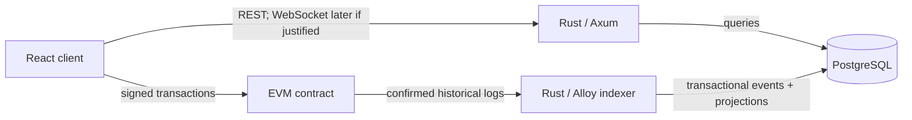

# Architecture

## Status and scope

This document defines the intended MVP boundaries. The prediction-market contract implements settlement, and the first Rust indexer slice persists confirmed canonical blocks, raw `MarketCreated` logs, a market projection, and a durable checkpoint. The health endpoint, frontend shell, and PostgreSQL Compose service also exist. Later event projections and recovery behavior remain explicitly deferred.

## System context

Foresyn uses a modular monolith: the API, domain types, and indexer may live in one Rust workspace and share carefully scoped modules. They do not need independently deployed services until scaling or operational ownership provides a concrete reason.

## Source-of-truth boundaries

| Concern | Authoritative store | Reason |
| --- | --- | --- |
| Market identity, deadline, lifecycle, and outcome | EVM contract | Settlement must be independently verifiable. |
| Stakes, aggregate pools, claims, and contract balance obligations | EVM contract | Financial state cannot depend on the backend being available or honest. |
| Title, description, image, category, and editorial content | PostgreSQL | Descriptive data is expensive and unnecessary for settlement. |
| Raw observed logs and canonical block identity | PostgreSQL projection of chain data | Needed for idempotency, audit, restart, and reorganization recovery. |
| Market/activity/position read models | PostgreSQL projection of chain data | APIs need indexed queries without repeatedly scanning RPC history. |
| A user's transaction authorization | User wallet | The backend must not hold user private keys. |

PostgreSQL is not an independent financial ledger. If a projection disagrees with finalized canonical chain history, the projection is wrong and must be repaired by replay.

The complete decision and its consequences are recorded in [ADR 0001](decisions/0001-on-chain-off-chain-boundary.md).

## On-chain state

The first contract stores only information required to enforce settlement:

- a compact market identifier;
- market deadline and lifecycle state;
- authorized resolution outcome;
- total YES and NO stake;
- each address's stake by outcome;
- claim status and aggregate claim accounting;
- a compact metadata reference or digest only if it has a settlement-relevant integrity purpose.

Long text, images, tags, search fields, cached aggregates, and API presentation fields do not belong on-chain.

## Proposed settlement boundary

The MVP uses native-chain currency and a pooled, pari-mutuel binary outcome. Winners receive their pro-rata share of the complete pool; a cancelled market refunds stakes. Integer rounding is handled by assigning the exact remaining wei to the final winning stake claimant, ensuring the contract never pays more than the pool and fully distributes it after all winners claim.

The formula, lifecycle, edge cases, and invariants are specified in [the settlement model](settlement-model.md) and [ADR 0002](decisions/0002-settlement-and-claim-model.md).

## Backend boundaries

The Axum layer owns HTTP concerns: routing, input validation, response mapping, and request tracing. Domain modules will own market/query concepts without depending on HTTP types. Repository modules will own SQLx queries and transactions.

Only `GET /health` exists now. It deliberately reports process health, not dependency readiness. Database and chain readiness can be added once those dependencies are real.

Planned read endpoints are:

- `GET /markets`
- `GET /markets/:id`
- `GET /markets/:id/activity`
- `GET /users/:address/positions`

These are query endpoints over projections; financial writes go through the user's wallet to the contract.

## Indexer reliability model

The implemented command performs one polling catch-up and exits. It computes the safe head as `latest_block - confirmations` with underflow producing no work, starts at the configured contract deployment block on first use, and verifies the last committed contract-scoped checkpoint against the RPC's canonical block before resuming at the following block. It requests logs only for the configured contract and exact `MarketCreated` signature in bounded block ranges. A future continuous runner may invoke the same catch-up repeatedly; subscriptions are not part of this slice.

For each canonical block, one database transaction:

1. follows an RPC parent-hash check against the previously committed block;
2. inserts the canonical block identity;
3. inserts raw logs using a unique event identity;
4. applies newly inserted `MarketCreated` events to the market projection;
5. advances the checkpoint and commits all records together.

Event identity is `(chain_id, transaction_hash, log_index)`. Block records retain `(chain_id, block_number, block_hash, parent_hash)`. The schema also enforces uniqueness of a log index within a block. Empty canonical blocks are stored and advance the checkpoint, so restarts do not rescan empty ranges. Replaying an identical block/log is a no-op; an identity collision with different data is an explicit error.

On a parent mismatch, the indexer returns a structured `ReorgDetected` error with the block number and expected/actual parent hashes before accepting that block. Automated rollback, common-ancestor search, deletion, and replay are deliberately deferred. A matching-topic log with malformed ABI data similarly stops the block before any of its database state commits; unexpected contract addresses or signatures are ignored defensively.

Configuration, RPC, database, decode, and continuity failures remain distinct error categories. Tracing spans include run, batch, block, chain, contract, range, hash, and event-count context without logging database credentials or RPC URLs.

## PostgreSQL schema scope

The first migration contains ABI-independent `indexed_blocks` and `blockchain_events` tables. The second adds a contract-scoped checkpoint and the exact `MarketCreated` projection: chain, contract, market ID, resolver, creator, deadline, metadata digest, creation block, and creation transaction hash. Position and settlement projections remain deferred until their event handlers are implemented.

Solidity `uint256 marketId` is stored as exact `NUMERIC(78,0)`, not signed `BIGINT`; `uint64 deadline` uses exact `NUMERIC(20,0)` for the same reason. Addresses, hashes, and digests use length-constrained `BYTEA`. These choices preserve the complete ABI value domains while retaining queryable numeric identities and deadlines.

The raw event table retains address, topics, and data for the `MarketCreated` logs selected by the current RPC filter, so that projection can be replayed after decoder changes. It is not a complete archive of all contract events; adding another event family requires the backfill or ingestion redesign described in ADR 0003.

## Why these technologies

**Rust** makes invalid state easier to constrain with types and provides predictable asynchronous behavior for an RPC-heavy indexer. Axum and Tokio keep the server surface small and composable.

**PostgreSQL** provides transactional updates, uniqueness constraints for idempotency, durable checkpoints, and the query capabilities needed by activity feeds and user positions. Redis is omitted until measured cache or fan-out needs exist.

**An indexer** bridges an append-only, RPC-oriented chain with product queries. It provides restartable catch-up, decoded projections, confirmations, and explicit reorganization recovery without treating PostgreSQL as authoritative settlement state.

## Security baseline

- User keys never enter the backend.
- Secrets and RPC credentials are loaded from the environment and `.env` is ignored.
- Contract design will apply checks-effects-interactions and reentrancy protection where value is transferred.
- Resolution requires explicit authorization; betting closes at the on-chain deadline.
- Pausing, if included, must have a documented incident-response purpose and must not become an informal way to alter outcomes.
- Contract and indexer tests must cover duplicate logs, restarts, reorgs, deadline boundaries, authorization, double claims, zero-winner outcomes, rounding, and solvency.
