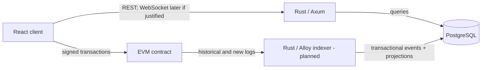

# Architecture

## Status and scope

This document defines the intended MVP boundaries. At the current foundation milestone, only the health endpoint, frontend shell, PostgreSQL Compose service, and initial indexing tables exist. Components marked as planned are not claims of completed functionality.

## System context

Foresyn uses a modular monolith: the API, domain types, and indexer may live in one Rust workspace and share carefully scoped modules. They do not need independently deployed services until scaling or operational ownership provides a concrete reason.

## Source-of-truth boundaries

| Concern | Authoritative store | Reason |
| --- | --- | --- |
| Market identity, deadline, lifecycle, and outcome | EVM contract | Settlement must be independently verifiable. |
| Stakes, aggregate pools, claims, and contract balance obligations | EVM contract | Financial state cannot depend on the backend being available or honest. |
| Title, description, image, category, and editorial content | PostgreSQL | Descriptive data is expensive and unnecessary for settlement. |
| Raw observed logs and canonical block identity | PostgreSQL projection of chain data | Needed for idempotency, audit, restart, and reorganization recovery. |
| Market/activity/position read models | PostgreSQL projection of chain data | APIs need indexed queries without repeatedly scanning RPC history. |
| A user's transaction authorization | User wallet | The backend must not hold user private keys. |

PostgreSQL is not an independent financial ledger. If a projection disagrees with finalized canonical chain history, the projection is wrong and must be repaired by replay.

The complete decision and its consequences are recorded in [ADR 0001](decisions/0001-on-chain-off-chain-boundary.md).

## On-chain state

The first contract should store only information required to enforce settlement:

- a compact market identifier;
- market deadline and lifecycle state;
- authorized resolution outcome;
- total YES and NO stake;
- each address's stake by outcome;
- claim status and aggregate claim accounting;
- a compact metadata reference or digest only if it has a settlement-relevant integrity purpose.

Long text, images, tags, search fields, cached aggregates, and API presentation fields do not belong on-chain.

## Proposed settlement boundary

The MVP uses native-chain currency and a pooled, pari-mutuel binary outcome. Winners receive their pro-rata share of the complete pool; a cancelled market refunds stakes. Integer rounding is handled by assigning the exact remaining wei to the final winning stake claimant, ensuring the contract never pays more than the pool and fully distributes it after all winners claim.

The formula, lifecycle, edge cases, and invariants are specified in [the settlement model](settlement-model.md). No contract business logic should be written until those rules are reviewed.

## Backend boundaries

The Axum layer owns HTTP concerns: routing, input validation, response mapping, and request tracing. Domain modules will own market/query concepts without depending on HTTP types. Repository modules will own SQLx queries and transactions.

Only `GET /health` exists now. It deliberately reports process health, not dependency readiness. Database and chain readiness can be added once those dependencies are real.

Planned read endpoints are:

- `GET /markets`
- `GET /markets/:id`
- `GET /markets/:id/activity`
- `GET /users/:address/positions`

These are query endpoints over projections; financial writes go through the user's wallet to the contract.

## Indexer reliability model (planned)

The indexer must poll confirmed block ranges and perform historical catch-up before following the head. A subscription may reduce latency later, but it cannot replace catch-up because subscriptions lose events during downtime.

For each batch, one database transaction will:

1. verify the stored parent block matches the canonical chain;
2. insert canonical block identities;
3. insert raw logs using a unique event identity;
4. apply decoded events to projections idempotently;
5. commit the block records and projections together.

Event identity is `(chain_id, transaction_hash, log_index)`. Block records retain `(chain_id, block_number, block_hash, parent_hash)`. The initial migration also enforces uniqueness of a log index within a block.

On a hash mismatch, the indexer will walk backward to a common ancestor, delete orphaned blocks (cascading to raw events), rebuild affected projections from retained canonical events, and resume. Processing trails the chain head by a configurable confirmation count. RPC calls use bounded exponential backoff with jitter and observable terminal errors.

The indexer itself is not implemented in this milestone.

## PostgreSQL schema scope

The first migration contains only `indexed_blocks` and `blockchain_events`. Their shapes are independent of the future contract ABI and directly support idempotency and reorganization handling. Market and position projection tables are deferred until contract events and identifiers are specified; adding them now would encode guesses as schema.

The raw event table retains address, topics, and data so projections can be replayed after decoder changes. Decoded payloads may be cached later, but raw canonical input remains available.

## Why these technologies

**Rust** makes invalid state easier to constrain with types and provides predictable asynchronous behavior for an RPC-heavy indexer. Axum and Tokio keep the server surface small and composable.

**PostgreSQL** provides transactional updates, uniqueness constraints for idempotency, durable checkpoints, and the query capabilities needed by activity feeds and user positions. Redis is omitted until measured cache or fan-out needs exist.

**An indexer** bridges an append-only, RPC-oriented chain with product queries. It provides restartable catch-up, decoded projections, confirmations, and explicit reorganization recovery without treating PostgreSQL as authoritative settlement state.

## Security baseline

- User keys never enter the backend.
- Secrets and RPC credentials are loaded from the environment and `.env` is ignored.
- Contract design will apply checks-effects-interactions and reentrancy protection where value is transferred.
- Resolution requires explicit authorization; betting closes at the on-chain deadline.
- Pausing, if included, must have a documented incident-response purpose and must not become an informal way to alter outcomes.
- Contract and indexer tests must cover duplicate logs, restarts, reorgs, deadline boundaries, authorization, double claims, zero-winner outcomes, rounding, and solvency.

