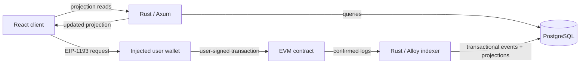

# Architecture

## Status and scope

This document defines the implemented prototype boundaries. The prediction-market contract implements settlement, the Rust indexer maintains canonical PostgreSQL projections, a small Axum REST API exposes scoped reads, and the React client can submit `takePosition` through an injected user wallet. Settlement-event projections and financial API writes remain explicitly deferred.

## System context

Foresyn uses a modular monolith: the API, domain types, and indexer may live in one Rust workspace and share carefully scoped modules. They do not need independently deployed services until scaling or operational ownership provides a concrete reason.

## Source-of-truth boundaries

| Concern | Authoritative store | Reason |
| --- | --- | --- |
| Market identity, deadline, lifecycle, and outcome | EVM contract | Settlement must be independently verifiable. |
| Stakes, aggregate pools, claims, and contract balance obligations | EVM contract | Financial state cannot depend on the backend being available or honest. |
| Title, description, image, category, and editorial content | PostgreSQL | Descriptive data is expensive and unnecessary for settlement. |
| Raw observed logs and canonical block identity | PostgreSQL projection of chain data | Needed for idempotency, audit, restart, and reorganization recovery. |
| Market/activity/position read models | PostgreSQL projection of chain data | APIs need indexed queries without repeatedly scanning RPC history. |
| A user's transaction authorization | User wallet | The backend must not hold user private keys. |

PostgreSQL is not an independent financial ledger. If a projection disagrees with finalized canonical chain history, the projection is wrong and must be repaired by replay.

The complete decision and its consequences are recorded in [ADR 0001](decisions/0001-on-chain-off-chain-boundary.md).

## On-chain state

The first contract stores only information required to enforce settlement:

- a compact market identifier;
- market deadline and lifecycle state;
- authorized resolution outcome;
- total YES and NO stake;
- each address's stake by outcome;
- claim status and aggregate claim accounting;
- a compact metadata reference or digest only if it has a settlement-relevant integrity purpose.

Long text, images, tags, search fields, cached aggregates, and API presentation fields do not belong on-chain.

## Proposed settlement boundary

The MVP uses native-chain currency and a pooled, pari-mutuel binary outcome. Winners receive their pro-rata share of the complete pool; a cancelled market refunds stakes. Integer rounding is handled by assigning the exact remaining wei to the final winning stake claimant, ensuring the contract never pays more than the pool and fully distributes it after all winners claim.

The formula, lifecycle, edge cases, and invariants are specified in [the settlement model](settlement-model.md) and [ADR 0002](decisions/0002-settlement-and-claim-model.md).

## Backend boundaries

The Axum layer owns routing, path/query validation, response DTOs, stable client errors, CORS, and server-side error tracing. The read repository owns SQLx queries and conversion from PostgreSQL values. Handlers contain no SQL and internal SQLx rows are never serialized directly.

The implemented routes are:

- `GET /health`
- `GET /api/markets?limit=&offset=`
- `GET /api/markets/:market_id`
- `GET /api/markets/:market_id/positions`

Every repository predicate includes the configured `chain_id` and `contract_address`. The API configuration reuses `DATABASE_URL`, `EVM_CHAIN_ID`, and `FORESYN_CONTRACT_ADDRESS` but does not require `EVM_RPC_URL` or indexer-only settings. Requests read PostgreSQL only; there is no per-request RPC fallback.

The read path is:

`EVM transaction -> Solidity event -> Rust indexer -> PostgreSQL projection -> Axum read API -> frontend`

The authority boundary remains:

- blockchain = financial source of truth;
- indexer = synchronization and deterministic repair layer;
- PostgreSQL = query-optimized read model;
- API = read interface over that model.

Financial writes bypass this API and go from the user's wallet to the contract. PostgreSQL and the REST responses are not settlement authority.

The only implemented product write is:

`React -> injected EIP-1193 wallet -> user signature -> ForesynPredictionMarket.takePosition`

The frontend supplies a minimal ABI and never receives a private key. Wallet RPC is
used for account discovery, configured-chain checks/switching, signing, transaction
submission, and receipt confirmation only. Contract and pool reads still come from
the REST projections rather than direct browser RPC calls.

The market list left-joins `market_states`, so a newly created market with no positions returns zero pools. Pool and stake totals are calculated with PostgreSQL exact numerics. Solidity `uint256`, `uint64` deadlines, and block provenance are serialized as decimal strings to avoid JavaScript precision loss. Addresses and digests are explicit lowercase fixed-width hex strings rather than JSON byte arrays.

Resolution, cancellation, and claim events are not projected. Consequently the API does not invent an Open, Resolved, or Cancelled status.

## Indexer reliability model

One-shot is the default: the implemented command performs one polling catch-up and exits. `--watch` runs that same `Indexer::run_once` operation, sleeps for two seconds by default, and repeats; `--poll-interval-ms` provides a small explicit override. There is no second ingestion pipeline and no subscription path. A fatal catch-up error terminates watch mode, while Ctrl+C exits after the current run or polling wait.

Every run computes the safe head as `latest_block - confirmations` with underflow producing no work, starts at the configured contract deployment block on first use, and verifies the last committed contract-scoped checkpoint against the RPC's canonical block before resuming at the following block. It requests the configured contract's exact `MarketCreated` and `PositionTaken` signatures in bounded block ranges, merges the query results, and orders them by block number, transaction index, then log index.

CLI parsing, RPC construction, and RPC chain-ID validation still precede database connection, migration, coverage-marker writes, and full reindex. Coverage validation or explicit full reindex runs once during startup. In `--full-reindex --watch` mode, the destructive action is never part of the repeated loop. `Indexer::run_once` also revalidates chain identity on every iteration as defense in depth.

The earlier indexer checkpoint covered only `MarketCreated`; it cannot prove that older `PositionTaken` logs were archived. Normal startup therefore requires a coverage marker proving `PositionTaken` ingestion began at `FORESYN_DEPLOYMENT_BLOCK`. An upgraded database with an existing checkpoint but no marker fails explicitly. The operator must run `indexer --full-reindex`, which atomically clears the configured chain's Foresyn index state under the current single-contract-per-chain model, records coverage, and then replays from deployment. Normal startup never performs that destructive transition silently.

For each canonical block, one database transaction:

1. follows an RPC parent-hash check against the previously committed block;
2. inserts the canonical block identity;
3. inserts raw logs using a unique event identity;
4. decodes known events through a small typed event model and applies a projection only when its raw row was newly inserted;
5. advances the checkpoint and commits all records together.

`PositionTaken` is projected from emitted post-state, not reconstructed as a second ledger. `market_states.yes_pool` and `no_pool` are set to the event's `yesPool` and `noPool`. A YES event sets that user's `yes_stake` to `userOutcomeStake` while preserving `no_stake`; a NO event does the inverse. New rows initialize the opposite side to zero.

Event identity is `(chain_id, transaction_hash, log_index)`. Block records retain `(chain_id, block_number, block_hash, parent_hash)`. The schema also enforces uniqueness of a log index within a block. Empty canonical blocks are stored and advance the checkpoint, so restarts do not rescan empty ranges. Replaying an identical block/log is a no-op; an identity collision with different data is an explicit error.

Checkpoint-hash and parent-hash mismatches enter the same bounded recovery path. Starting at the current stored checkpoint, the indexer compares the stored and RPC block hashes at each height while walking backward only as far as `FORESYN_DEPLOYMENT_BLOCK`. RPC discovery completes before any destructive SQL transaction begins. The first matching hash is the common ancestor; a missing stored/RPC block, invalid RPC block number, or lack of an ancestor is an explicit error and performs no rollback.

After discovery, one PostgreSQL transaction locks the chain's checkpoint rows and ancestor block, deletes `indexed_blocks` strictly above the ancestor, and relies on foreign-key cascades to remove orphaned raw events, immutable market projections, and affected checkpoints. It then clears the configured contract's mutable market and position tables, reads retained canonical `PositionTaken` raw logs from deployment through the ancestor in deterministic EVM order, decodes and reapplies them, restores the configured contract checkpoint to the ancestor, and commits. No RPC call occurs inside this destructive transaction. The normal historical catch-up path then resumes at `ancestor + 1`. Only one recovery is attempted per `run_once` catch-up iteration, so a second concurrent reorganization fails explicitly instead of looping. A later watch iteration starts a fresh bounded attempt. A matching-topic log with malformed ABI data similarly stops its block before any database state commits; unexpected contract addresses or signatures are ignored defensively.

Configuration, RPC, database, decode, and continuity failures remain distinct error categories. Tracing spans include run, batch, block, chain, contract, range, hash, and event-count context without logging database credentials or RPC URLs.

## Frontend transaction completion

MetaMask reporting a receipt is not treated as projection completion. The client
captures the selected outcome's current API pool and connected user's stake before
submission. After a successful receipt it polls the market and position REST routes
at a bounded interval. Completion requires both values to be at least the exact
`BigInt` baseline plus the submitted wei. API reads never fall back to contract RPC,
and a polling timeout reports that the transaction is on-chain but indexing is
delayed rather than fabricating success.

The UI listens for `accountsChanged` and `chainChanged`. An account change updates
the active signer identity; a chain change away from the configured chain disables
the form and offers `wallet_switchEthereumChain`. Local development may use
`wallet_addEthereumChain` with the configured wallet RPC URL.

## PostgreSQL schema scope

The first migration contains ABI-independent `indexed_blocks` and `blockchain_events` tables. The second adds a contract-scoped checkpoint and the exact `MarketCreated` projection: chain, contract, market ID, resolver, creator, deadline, metadata digest, creation block, and creation transaction hash. The third adds `market_states`, `market_positions`, and the PositionTaken-from-deployment coverage marker. Settlement and claim projections remain deferred.

Solidity `uint256 marketId` is stored as exact `NUMERIC(78,0)`, not signed `BIGINT`; `uint64 deadline` uses exact `NUMERIC(20,0)` for the same reason. Addresses, hashes, and digests use length-constrained `BYTEA`. These choices preserve the complete ABI value domains while retaining queryable numeric identities and deadlines.

The raw event table retains address, topics, and data for the `MarketCreated` and `PositionTaken` logs selected by the current RPC filters. It is the local canonical replay archive for those event families, not a complete archive of every Foresyn event. Adding another event family requires another explicit backfill/reindex or a redesigned ingestion/checkpoint model.

The current `indexed_blocks` primary key is chain-scoped, while checkpoints and projections are contract-scoped. A block rewind therefore cascades through all indexed data above the ancestor for that `chain_id`, not just one contract. This milestone supports one configured Foresyn contract per chain; multi-contract indexing on the same chain requires coordinated checkpoints/replay or a schema redesign. Rows belonging to another `chain_id` are not affected.

The immutable `MarketCreated` projection is recovered by the existing block cascade and canonical branch replay. Mutable `market_states` and `market_positions` cannot be repaired by deleting only rows whose latest update was orphaned: such a row may also contain retained pre-ancestor state. Recovery therefore clears and rebuilds both from retained canonical `PositionTaken` logs inside the rollback transaction. See [ADR 0005](decisions/0005-position-projections.md).

## Why these technologies

**Rust** makes invalid state easier to constrain with types and provides predictable asynchronous behavior for an RPC-heavy indexer. Axum and Tokio keep the server surface small and composable.

**PostgreSQL** provides transactional updates, uniqueness constraints for idempotency, durable checkpoints, and the query capabilities needed by activity feeds and user positions. Redis is omitted until measured cache or fan-out needs exist.

**An indexer** bridges an append-only, RPC-oriented chain with product queries. It provides restartable catch-up, decoded projections, confirmations, and explicit reorganization recovery without treating PostgreSQL as authoritative settlement state.

## Security baseline

- User keys never enter the React application or backend; the injected wallet signs client-side.
- Axum has no financial transaction endpoint, and no server-side signing exists.
- Frontend validation and wrong-network blocking improve UX but are not security boundaries.
- Solidity enforces stake, outcome, deadline, lifecycle, and value rules.
- The blockchain is the financial source of truth; the API is not settlement authority.
- PostgreSQL projections are disposable and deterministically rebuildable.
- Secrets and RPC credentials are loaded from the environment and `.env` is ignored.
- Contract value transfers apply checks-effects-interactions and reentrancy protection.
- Resolution requires explicit authorization; betting closes at the on-chain deadline.
- Pausing, if included, must have a documented incident-response purpose and must not become an informal way to alter outcomes.
- Contract and indexer tests must cover duplicate logs, restarts, reorgs, deadline boundaries, authorization, double claims, zero-winner outcomes, rounding, and solvency.
